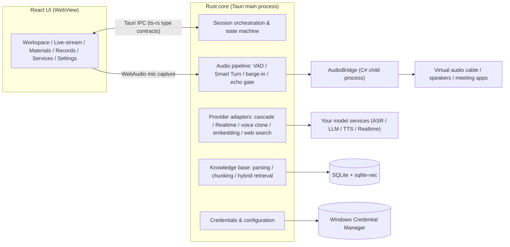

<h1 align="center">RoleAI</h1>

<p align="center">
  <a href="README.md">简体中文</a> | English
</p>

<p align="center">
  <a href="https://notintosports.github.io/RoleAI/">Live demo</a> ·
  <a href="https://github.com/NotIntoSports/RoleAI/releases">Download</a> ·
  <a href="guide/README.md">Docs</a>
</p>

<p align="center">
  
</p>

<p align="center"><strong>A local-first, real-time voice AI role assistant for Windows. A Rust + Tauri full-duplex voice pipeline built for mock interview practice, meeting assistance, and live-stream presenting.</strong></p>

<p align="center">
  <a href="https://github.com/NotIntoSports/RoleAI/actions/workflows/ci.yml"></a>
  
  
  
  
  
</p>


## Why this project

Real-time voice is the most natural way to practice speaking: whether you finish your thought, go off topic, or ramble — you only find out by actually talking. RoleAI wires speech recognition, an LLM, and speech synthesis into one full-duplex pipeline, so an AI in the role you define (interviewer, HR, speaking coach, meeting assistant, product presenter) talks with you live and responds the moment you finish. Roles, documents, and session records all stay on your machine; model services are configured and paid for by you. No accounts, no data sent to our servers.

Typical uses: mock interview training, live meeting assistance, live-stream product presenting — or simply a local voice workstation with a role you can fully customize.

## Features

### Mock interview practice

- Five interview-related role presets — Interviewer, HR, Strict Interviewer, Candidate Partner, Speaking Coach. The preset prompts require the AI to ask questions and give feedback based only on the experience and materials you provide: no fabricated résumés, no hiring decisions.
- Import a job description and your own documents; the AI asks questions grounded in them. Every session produces a structured summary (highlights, action items, limitations, evidence) you can review and export on the Records page.
- True full-duplex conversation: the AI can be interrupted mid-sentence, and so can you — much closer to the rhythm of a real interview.

| Workspace | Knowledge base |
| --- | --- |
|  |  |

### Meeting assistant

- A C# AudioBridge child process captures loopback audio from a chosen meeting process on your machine — no need to hand your microphone to another app.
- Answers call-outs using the meeting context and documents you designate, separating facts from assumptions and open questions, and never interrupts the discussion on its own.
- Manual takeover: switch back to your own microphone with one click and the AI steps aside.

### Live-stream presenting

- Generates a segmented script from local product materials; you confirm each segment, then it presents segment by segment — no invented prices, stock, or promises.
- The stage shows an image or looping video; script generation, editing, and audience-question insertion all happen on the Live-stream page.

### Knowledge base

- Import PDF, DOCX, and plain-text documents; chunked semantically by section, retrieved with a hybrid of FTS full-text search and sqlite-vec vector search (reciprocal rank fusion).
- Documents, indexes, and session records live in a local SQLite database with backup and restore.

| Live-stream | Session records |
| --- | --- |
|  |  |

### Records & security

- Every session produces an evidence-cited summary; export it, or delete records behind a two-step confirmation.
- API keys are stored in Windows Credential Manager and zeroized in memory; the UI and config files only ever hold key references, never plaintext.

## Technical highlights

- **Two-stage turn detection**: Silero VAD (16 kHz / 32 ms windows) decides whether someone is speaking; a Smart Turn completeness model (ONNX int8, bundled with the app) decides whether they are done — no more getting cut off mid-sentence. See [audio/vad.rs](src-tauri/src/audio/vad.rs) and [audio/smart_turn.rs](src-tauri/src/audio/smart_turn.rs).
- **Statically linked onnxruntime**: ort links onnxruntime 1.22 at build time, so the app never picks up a stale DLL from the system directory — a bug we actually hit. See [Cargo.toml](src-tauri/Cargo.toml).
- **Echo gate and barge-in**: during playback, a sliding window of voiced frames plus an energy-assist check detects interruptions (roughly 200–260 ms trigger latency); a text-level filter then drops transcriptions that match what the AI itself just said (bigram Dice ≥ 0.85), killing self-question-self-answer loops. See [audio/barge_in.rs](src-tauri/src/audio/barge_in.rs) and [services/echo_guard.rs](src-tauri/src/services/echo_guard.rs).
- **Cascade and end-to-end modes**: the cascade mode chains ASR → LLM → TTS, each stage configurable to any OpenAI-compatible API (with bounded retries for connection errors and HTTP 429/502/503/504); the Realtime mode runs a full-duplex WebSocket with adapters for the OpenAI, Alibaba DashScope, and Zhipu protocol dialects. See [providers/cascade.rs](src-tauri/src/providers/cascade.rs) and [providers/realtime_protocol.rs](src-tauri/src/providers/realtime_protocol.rs).
- **Reconnect with context replay**: a dropped Realtime connection reconnects with exponential backoff (500 ms base, 30 s cap), then replays the conversation with per-item confirmation, skipping the assistant's own turns — this fixed a Qwen disconnect loop. See [providers/realtime_session.rs](src-tauri/src/providers/realtime_session.rs).
- **Hybrid retrieval**: SQLite FTS5 full-text search and sqlite-vec vector search run in parallel, fused by reciprocal rank fusion; the vector table is rebuilt automatically when the embedding dimensions change. See [materials/hybrid.rs](src-tauri/src/materials/hybrid.rs).
- **OS-managed credentials**: the `keyring` crate reads and writes Windows Credential Manager, `zeroize` wipes in-memory copies, and a memory-only fallback keeps non-Windows builds testable. See [secrets/](src-tauri/src/secrets/mod.rs).
- **ts-rs type contracts**: Rust DTOs generate [src/generated/bindings.ts](src/generated/bindings.ts), so a field change on either side breaks the build; contract tests also pin the IPC surface. See [contracts.rs](src-tauri/src/contracts.rs).
- **Security surface baseline**: the capability whitelist and other critical files are hash-pinned in [tests/tauri/security-surface-baseline.json](tests/tauri/security-surface-baseline.json) — any drift turns the suite red.
- **C# AudioBridge child process**: MIT-licensed NAudio.Wasapi handles meeting-process loopback capture and streaming playback to a chosen device, with a frame protocol for interrupt-and-clear and drain acknowledgements; the published binary ships its own .NET runtime. See [native/AudioBridge](native/AudioBridge/README.md).

## Architecture



## Supported services

| Capability | Protocol / service | Notes |
| --- | --- | --- |
| ASR / LLM / TTS (cascade) | Any OpenAI-compatible API | Configure each stage independently, mix providers |
| End-to-end real-time voice (Realtime) | OpenAI-compatible Realtime WebSocket | Adapters for OpenAI, Alibaba DashScope, and Zhipu dialects |
| Voice cloning | Zhipu (upload → clone), Alibaba DashScope (incl. one-call qwen enrollment) | Clone a voice from a reference recording for TTS / Realtime |
| Embeddings | OpenAI-compatible | Built-in providers or a custom URL |
| Web search | Provider-native browsing | Optional capability injected into the cascade LLM stage |
| Meeting audio | Local virtual audio cable (e.g. VB-CABLE) | Captured / played by AudioBridge; system defaults are never changed |

Providers, keys, and connectivity tests are managed in the in-app Services page — no config files to hand-edit.

## Getting started

### Option 1: download the installer

Grab the latest Windows x64 installer from [Releases](https://github.com/NotIntoSports/RoleAI/releases). The installer is not code-signed yet, so SmartScreen may show "Windows protected your PC" on first run — click "More info → Run anyway". If you'd rather not, build from source instead.

### Option 2: build from source

Requirements: Windows x64, [Rust 1.96](https://www.rust-lang.org/), [Node.js 24](https://nodejs.org/), the [Microsoft Edge WebView2 Runtime](https://developer.microsoft.com/microsoft-edge/webview2/), and the .NET 10 SDK (to build AudioBridge).

```powershell
npm install
npm run tauri:dev      # develop
npm run tauri:build    # produce the installer
```

### First run (3 steps)

1. **Configure a provider**: open the Services page, pick a preset provider or enter a custom URL, save your API key (it goes into Credential Manager), and hit "Test".
2. **Pick a role**: choose a built-in role on the Workspace (Interviewer / Meeting assistant / Product presenter…) or write your own prompt and opening line.
3. **Start a session**: launch a session on the Workspace and allow microphone access. For mock interview practice, import your résumé and the job description into the Materials page first.

## Project layout

```
├── src/                    # React frontend (pages, feature modules, Tauri IPC wrapper)
│   ├── app/                # Routing and page shell
│   ├── screens/            # The six pages
│   ├── features/           # Session, materials, live-stream, diagnostics modules
│   ├── api/                # The single Tauri IPC entry point (commands.ts)
│   └── generated/          # ts-rs generated types (do not edit by hand)
├── src-tauri/              # Rust core
│   ├── src/audio/          # Capture, VAD, Smart Turn, segmentation, barge-in monitor
│   ├── src/providers/      # Cascade / Realtime / voice clone / embedding / search adapters
│   ├── src/services/       # Session orchestration, echo gate, materials, roles, voice routes
│   ├── src/materials/      # Document parsing, chunking, hybrid retrieval, backup
│   ├── src/secrets/        # Credential Manager wrapper
│   ├── src/commands/       # Tauri commands (the IPC surface)
│   └── capabilities/       # Tauri capability whitelist (pinned by the security baseline)
├── native/AudioBridge/     # C# meeting-audio child process (NAudio.Wasapi)
├── tests/tauri/            # Node contract tests (frontend contract, security baseline, README contract…)
├── guide/                  # Public docs (architecture, voice pipeline, security, configuration)
└── resources/              # Bundled resources (Smart Turn model, etc.)
```

## Tests & quality

```powershell
npm run test:tauri          # full gate
npm run test:tauri-package  # packaged smoke test
```

`test:tauri` runs 600+ Rust unit tests, the frontend vitest suite, the Node contract tests, and then builds the frontend. `test:tauri-package` launches the packaged executable in an isolated temporary config directory, waits for the main window, and asserts the process tree contains no Node, Go, Python, PostgreSQL, or Nginx — and that the install directory carries no local config, database, logs, or credential test files.

Contract tests pin several classes of regressions: only `src/api/commands.ts` may touch the Tauri IPC; drift in the capability whitelist or any hash-pinned file fails the suite; the README and CI must describe the single Tauri product path.

## Roadmap

- [x] Full-duplex real-time voice sessions (cascade + Realtime modes)
- [x] Silero VAD + Smart Turn two-stage turn detection, echo gate, barge-in
- [x] Local knowledge base (PDF / DOCX / text, hybrid retrieval)
- [x] Session summaries with export, voice cloning, live-stream scripts
- [x] Windows Credential Manager key storage, security surface baseline tests
- [ ] In-browser demo (real UI + mocked backend)
- [ ] Benchmarks and offline audio evaluation reports (turn-end accuracy, false-interruption rate, end-to-end latency)
- [ ] Managed OBS, one-click virtual camera, and hotkey UI — deferred; the client currently only resolves local OBS / AudioBridge paths and probes prerequisites, and never creates scenes, browser sources, or starts the Virtual Camera
- [ ] macOS / Linux support

## Responsible use

RoleAI is built for practice, assistance, and content creation. When you use it in a meeting or a live stream, disclose to participants how AI participates and how the session is recorded, and have a human review its output. The preset role prompts all carry factual guardrails (no fabricated experience, no automated hiring decisions, no price or effect promises) — keep the same guardrails when writing custom roles.

## Name & compatibility

The app is called **RoleAI**; the Windows executable is `role-ai-desktop.exe`. To keep reading existing configuration and data, the original app identifier, the `%APPDATA%\AI Virtual Assistant` config directory, and the `AI_VIRTUAL_ASSISTANT_CONFIG` environment variable are unchanged. The GitHub repository name and local folder names do not affect the app name.

## Acknowledgements & license

This project stands on the shoulders of: [Tauri](https://github.com/tauri-apps/tauri), [React](https://github.com/facebook/react), [Vite](https://github.com/vitejs/vite), [rusqlite](https://github.com/rusqlite/rusqlite), [sqlite-vec](https://github.com/asg017/sqlite-vec), [Silero VAD](https://github.com/snakers4/silero-vad) (via [silero-vad-rust](https://github.com/aicore-libs/silero-vad-rust) and [ort](https://github.com/pykeio/ort)), [smart-turn](https://huggingface.co/pipecat-ai) by pipecat-ai, [NAudio.Wasapi](https://github.com/naudio/NAudio), [pdf-extract](https://github.com/jrmuizel/pdf-extract), [docx-rs](https://github.com/bokuweb/docx-rs), [keyring](https://github.com/hwchen/keyring-rs), [lucide](https://github.com/lucide-icons/lucide), and more — see [THIRD_PARTY_NOTICES.md](THIRD_PARTY_NOTICES.md) for the full list.

The code is released under the [MIT license](LICENSE).
