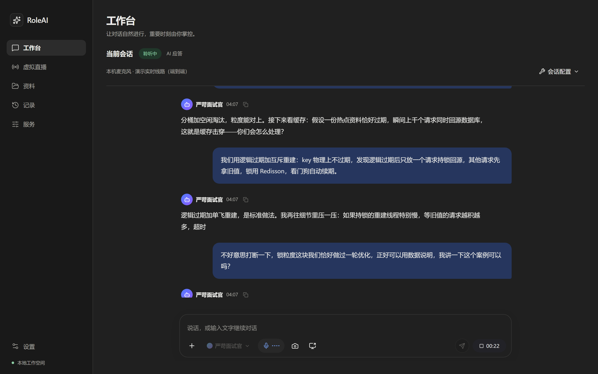
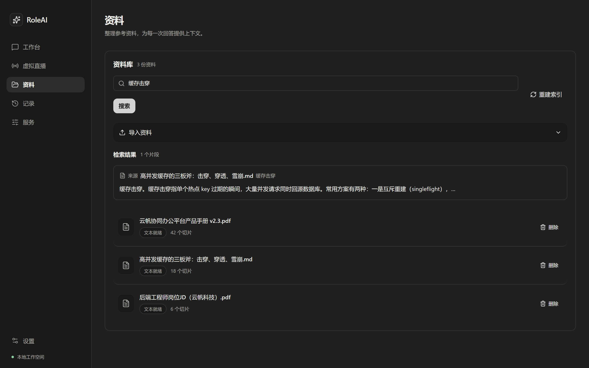
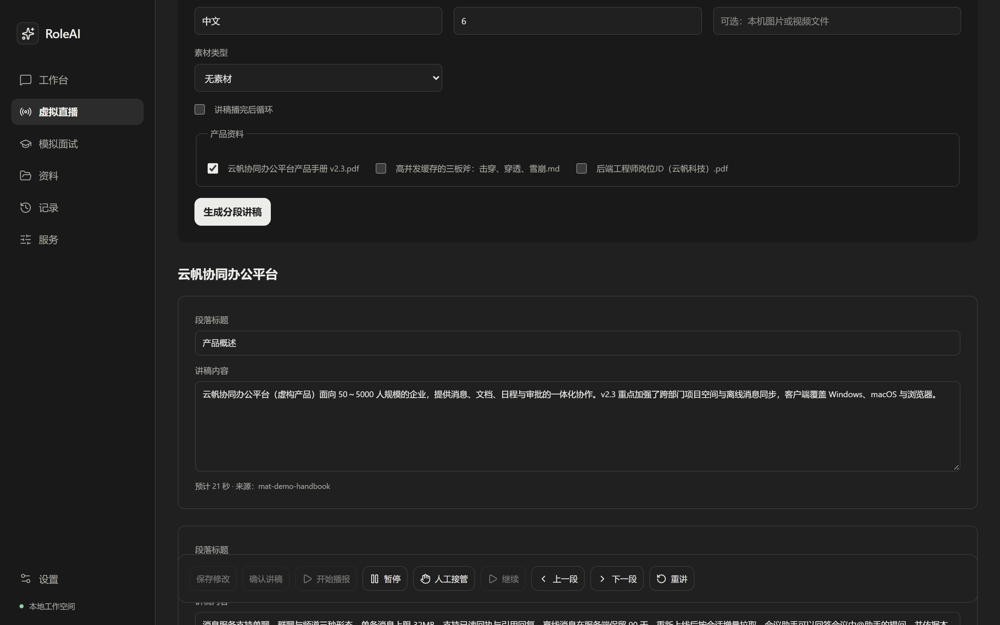
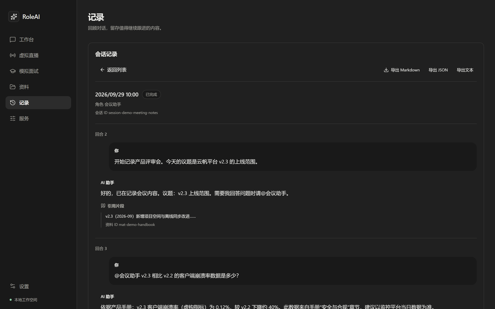
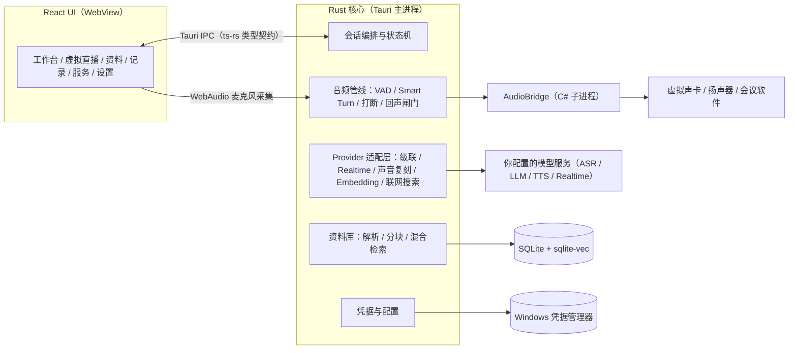

<h1 align="center">RoleAI</h1>

<p align="center">
  <a href="README.en.md">English</a> ·
  <a href="https://notintosports.github.io/RoleAI/">在线演示</a> ·
  <a href="https://github.com/NotIntoSports/RoleAI/releases">下载</a> ·
  <a href="guide/README.md">文档</a>
</p>

<p align="center">
  
</p>

<p align="center"><strong>本地优先的 Windows 实时语音 AI 角色助手。Rust + Tauri 全双工语音管线，支持模拟面试训练、会议助手与直播讲解。</strong></p>

<p align="center">
  <a href="https://github.com/NotIntoSports/RoleAI/actions/workflows/ci.yml"></a>
  
  
  
  
  
</p>



## 为什么做这个项目

实时语音是最自然的表达练习方式：说得完不完整、有没有答非所问，只有真的开口才知道。RoleAI 把语音识别、大模型和语音合成跑成一条全双工管线，让 AI 以你设定的角色（面试官、HR、表达教练、会议助手、直播讲解员）和你实时对话，说完就给反馈。所有角色、资料和会话记录都保存在本机，模型服务由你自己配置和付费，没有账号，也不上传数据到我们的服务器。

它适合用来做模拟面试训练、会议发言辅助、直播产品讲解，也可以当作一个可定制角色的本地语音工作台。

## 功能特性

### 模拟面试训练

- 内置面试官、HR、严苛面试官、求职者陪练、表达教练五种面试相关角色，预设提示词要求 AI 只依据你提供的真实经历提问与反馈，不编造履历、不作录用决定。
- 支持导入岗位 JD 与个人资料，AI 结合资料提问；每次会话生成结构化纪要（摘要、优势、跟进建议、局限、证据），可在「记录」页回看与导出。
- 全双工对话：你说到一半 AI 能被打断，AI 说到一半你也能插话，接近真实面试的节奏。

| 工作台 | 资料库 |
| --- | --- |
|  |  |

### 会议助手

- 通过 C# AudioBridge 子进程对指定会议进程做本机回环音频采集，不需要把麦克风让给别的软件。
- 根据会议上下文和指定资料回答点名提问，区分事实、推测和待确认事项，不主动打断讨论。
- 人工接管模式：一键切回自己的麦克风，AI 退到幕后。

### 直播讲解

- 从本地产品资料生成分段讲稿，逐段确认后按段讲解，不编造价格、库存或效果承诺。
- 舞台支持图片或循环视频；讲稿生成、修改、插问都在「虚拟直播」页完成。

### 知识库

- 导入 PDF、DOCX、纯文本资料，按章节语义分块，FTS 全文检索 + sqlite-vec 向量检索做混合召回（倒数排序融合）。
- 资料库、索引、会话记录全部存本机 SQLite，支持备份与恢复。

| 虚拟直播 | 会话记录 |
| --- | --- |
|  |  |

### 会话记录与安全

- 每轮对话自动生成带证据引用的纪要，支持导出与两步确认删除。
- API Key 存 Windows 凭据管理器（Credential Manager），内存中零化清零；界面与配置文件里只有密钥引用，没有明文。

## 技术亮点

- **两级语义断句**：Silero VAD（16 kHz / 32 ms 窗）判断「在说话」，Smart Turn 回合完成度模型（ONNX int8，随包分发）判断「说完了」，解决「一句话停顿就被抢答」的问题。见 [audio/vad.rs](src-tauri/src/audio/vad.rs)、[audio/smart_turn.rs](src-tauri/src/audio/smart_turn.rs)。
- **静态链接 onnxruntime**：ort 构建期静态链接 onnxruntime 1.22，避免运行时误加载系统目录里的旧版 DLL——这是真踩过的坑。见 [Cargo.toml](src-tauri/Cargo.toml)。
- **回声闸门与打断（barge-in）**：播报期间用滑动窗人声计数 + 能量辅助判定识别插话（触发延迟约 200–260 ms）；文本层再用 bigram Dice 系数把「AI 自己的声音被麦克风回收」的转写整轮丢弃，杜绝自问自答。见 [audio/barge_in.rs](src-tauri/src/audio/barge_in.rs)、[services/echo_guard.rs](src-tauri/src/services/echo_guard.rs)。
- **级联与端到端两种模式**：级联模式 ASR → LLM → TTS 三阶段自由组合任意 OpenAI 兼容服务（带连接错误与 429/502/503/504 的有界重试）；Realtime 模式走 WebSocket 全双工长连接，对 OpenAI、阿里云 DashScope、智谱三种协议方言做了适配。见 [providers/cascade.rs](src-tauri/src/providers/cascade.rs)、[providers/realtime_protocol.rs](src-tauri/src/providers/realtime_protocol.rs)。
- **断线重连与上下文回放**：Realtime 断线按指数退避重连（500 ms 起、30 s 封顶），重连后上下文逐条确认回放并跳过 AI 自己的轮次，修复过 qwen 断连死循环。见 [providers/realtime_session.rs](src-tauri/src/providers/realtime_session.rs)。
- **混合检索**：SQLite FTS5 全文检索与 sqlite-vec 向量检索两路召回，倒数排序融合（RRF）打分；嵌入维度变化自动重建向量表。见 [materials/hybrid.rs](src-tauri/src/materials/hybrid.rs)。
- **凭据管理器保管密钥**：`keyring` crate 读写 Windows Credential Manager，`zeroize` 清零内存副本，非 Windows 平台回退内存实现便于测试。见 [secrets/](src-tauri/src/secrets/mod.rs)。
- **ts-rs 类型契约**：Rust DTO 自动生成 [src/generated/bindings.ts](src/generated/bindings.ts)，前端与后端字段改一边就会编译失败；另有契约测试锁定 IPC 面不可膨胀。见 [contracts.rs](src-tauri/src/contracts.rs)。
- **安全面基线测试**：能力白名单、IPC 命令面等关键文件哈希固定在 [tests/tauri/security-surface-baseline.json](tests/tauri/security-surface-baseline.json)，任何漂移直接红测。
- **C# AudioBridge 子进程**：复用 MIT 许可的 NAudio.Wasapi 做会议进程回环采集与指定设备流式播放，帧协议支持打断清空、播净回执，发布产物自带 .NET 运行时。见 [native/AudioBridge](native/AudioBridge/README.md)。

## 架构



## 支持的服务

| 能力 | 协议 / 服务 | 说明 |
| --- | --- | --- |
| 语音识别 / 大模型 / 语音合成（级联） | 任意 OpenAI 兼容 API | 三个阶段分别配置，可混搭不同供应商 |
| 端到端实时语音（Realtime） | OpenAI 兼容 Realtime WebSocket | 已适配 OpenAI、阿里云 DashScope、智谱三种方言 |
| 声音复刻 | 智谱（上传→克隆两步）、阿里云 DashScope（含 qwen 单调用复刻） | 上传参考音频生成音色，用于 TTS / Realtime |
| Embedding | OpenAI 兼容 | 可选供应商或自定义 URL |
| 联网搜索 | 供应商原生联网能力 | 注入级联 LLM 阶段，可选 |
| 会议音频 | 本机虚拟声卡（如 VB-CABLE） | AudioBridge 采集 / 播放，不改动系统默认设备 |

服务商列表、密钥与连通性测试都在应用内「服务」页完成，不需要手改配置文件。

## 快速开始

### 方式一：下载安装包

到 [Releases](https://github.com/NotIntoSports/RoleAI/releases) 下载最新的 Windows x64 安装包。安装包未做代码签名，首次运行 SmartScreen 可能提示「已保护你的电脑」，点击「更多信息 → 仍要运行」即可；介意的话可以按下面的方式从源码构建。

### 方式二：从源码构建

环境要求：Windows x64、[Rust 1.96](https://www.rust-lang.org/)、[Node.js 24](https://nodejs.org/)、[Microsoft Edge WebView2 Runtime](https://developer.microsoft.com/microsoft-edge/webview2/)、.NET 10 SDK（构建 AudioBridge 用）。

```powershell
npm install
npm run tauri:dev      # 开发调试
npm run tauri:build    # 产出安装包
```

### 首次配置（3 步）

1. **配服务**：打开「服务」页，选一个预设供应商或填自定义 URL，保存 API Key（进凭据管理器），点「测试」确认连通。
2. **选角色**：在工作台选一个内置角色（面试官 / 会议助手 / 直播讲解员……），或自定义提示词与开场白。
3. **开会话**：回到工作台启动会话，授权麦克风后开口说话；要做模拟面试训练，先把简历和岗位资料导入「资料」页。

## 项目结构

```
├── src/                    # React 前端（页面、功能模块、Tauri IPC 封装）
│   ├── app/                # 路由与页面壳
│   ├── screens/            # 六个页面
│   ├── features/           # 会话、资料、直播、诊断等功能模块
│   ├── api/                # 唯一的 Tauri IPC 入口（commands.ts）
│   └── generated/          # ts-rs 自动生成的类型（勿手改）
├── src-tauri/              # Rust 核心
│   ├── src/audio/          # 采集、VAD、Smart Turn、分段、打断监听
│   ├── src/providers/      # 级联 / Realtime / 复刻 / Embedding / 搜索适配
│   ├── src/services/       # 会话编排、回声闸门、资料库、角色、语音线路
│   ├── src/materials/      # 资料解析、分块、混合检索、备份
│   ├── src/secrets/        # 凭据管理器封装
│   ├── src/commands/       # Tauri 命令（IPC 面）
│   └── capabilities/       # Tauri 能力白名单（安全面基线锁定）
├── native/AudioBridge/     # C# 会议音频子进程（NAudio.Wasapi）
├── tests/tauri/            # Node 契约测试（前端契约、安全面基线、README 契约等）
├── guide/                  # 公开文档（架构、语音管线、安全、配置）
└── resources/              # 随包资源（Smart Turn 模型等）
```

## 测试与质量

```powershell
npm run test:tauri          # 全量门禁
npm run test:tauri-package  # 打包冒烟
```

`test:tauri` 依次运行 600+ 个 Rust 单元测试、前端 vitest 测试、Node 契约测试，并构建前端产物。`test:tauri-package` 在隔离的临时配置目录中启动已打包的可执行文件，等待主窗口可见，并断言进程树里没有 Node、Go、Python、PostgreSQL 或 Nginx，安装包目录也没有混入本地配置、数据库、日志或凭据测试文件。

契约测试把几类回归钉死：前端只有 `src/api/commands.ts` 能碰 Tauri IPC；Tauri 能力白名单与关键文件哈希漂移即失败；README 与 CI 只描述 Tauri 单一产品路径。

## 路线图

- [x] 全双工实时语音会话（级联 + Realtime 双模式）
- [x] Silero VAD + Smart Turn 两级断句、回声闸门、打断
- [x] 本地知识库（PDF / DOCX / 文本，混合检索）
- [x] 会话纪要与导出、声音复刻、直播讲稿
- [x] Windows 凭据管理器保管密钥、安全面基线测试
- [ ] 在线演示版（浏览器里跑真实界面 + 模拟后端）
- [ ] 基准测试与离线音频评测报告（断句准确率、误打断率、端到端延迟）
- [ ] 托管 OBS、虚拟摄像头一键启停与快捷键 UI —— 已延期；当前客户端只做本机 OBS / AudioBridge 路径解析和前置探测，不会创建场景、浏览器源或启动 Virtual Camera
- [ ] macOS / Linux 支持

## 负责任使用

RoleAI 用于练习、辅助和内容创作；在会议或直播中使用时，请告知参与者 AI 参与和记录方式，并由人工复核输出。预设角色的提示词都写入了事实边界（不编造履历、不作自动录用决定、不承诺价格与效果），请在自定义角色时保持同样的约束。

## 名称与兼容性

应用名称为 **RoleAI**，Windows 可执行文件为 `role-ai-desktop.exe`。为继续读取已有配置与数据，保留原有应用标识、`%APPDATA%\AI Virtual Assistant` 配置目录及 `AI_VIRTUAL_ASSISTANT_CONFIG` 环境变量。GitHub 仓库名与本地目录名不影响应用名称。

## 致谢与许可证

本项目站在这些开源项目的肩膀上：[Tauri](https://github.com/tauri-apps/tauri)、[React](https://github.com/facebook/react)、[Vite](https://github.com/vitejs/vite)、[rusqlite](https://github.com/rusqlite/rusqlite)、[sqlite-vec](https://github.com/asg017/sqlite-vec)、[Silero VAD](https://github.com/snakers4/silero-vad)（经 [silero-vad-rust](https://github.com/sheldonix/silero-vad-rust) 与 [ort](https://github.com/pykeio/ort)）、[smart-turn](https://huggingface.co/pipecat-ai)（pipecat-ai）、[NAudio.Wasapi](https://github.com/naudio/NAudio）、[pdf-extract](https://github.com/jrmuizel/pdf-extract)、[docx-rs](https://github.com/bokuweb/docx-rs)、[keyring](https://github.com/hwchen/keyring-rs)、[lucide](https://github.com/lucide-icons/lucide) 等，完整清单见 [THIRD_PARTY_NOTICES.md](THIRD_PARTY_NOTICES.md)。

代码以 [MIT](LICENSE) 许可证发布。
