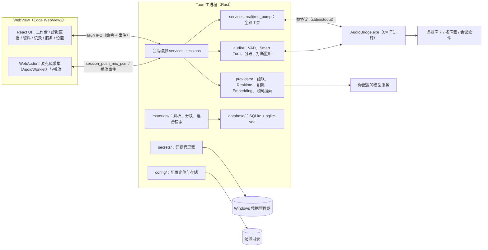
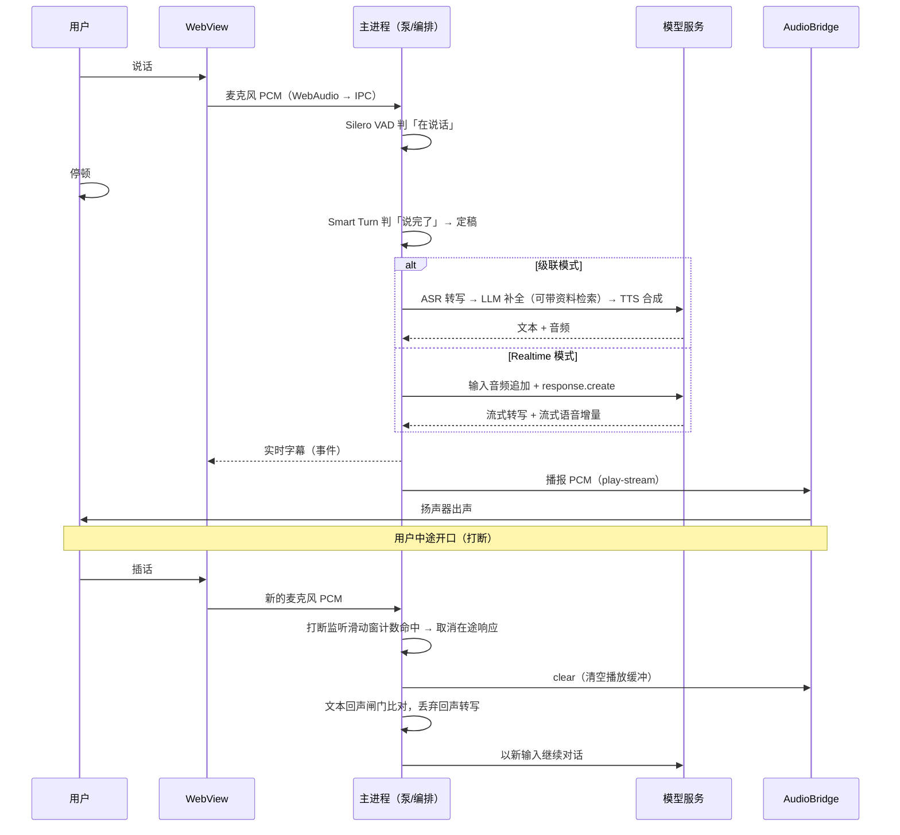

# 架构说明

本文描述 RoleAI 的整体结构：模块职责、进程模型、IPC 与数据存储、线程模型。读完后你应该能在源码里快速定位任何一块功能。语音管线的细节（断句、回声、打断、重连）单独成篇，见[实时语音管线深度解析](realtime-voice-pipeline.md)。

## 总览

## 模块职责

Rust 侧按目录划分，每个目录一类职责：

| 目录 / 文件 | 职责 |
| --- | --- |
| `src-tauri/src/app_state.rs` | 全局 `AppState`：数据库句柄、会话服务、音频路由、直播状态、麦克风入口 `MicIngestHandle`，全部挂在 `tauri::State` 上 |
| `src-tauri/src/commands/` | Tauri IPC 命令层，按域拆成 `config` / `sessions` / `materials` / `voice` / `livestream` / `obs` / `system`，只做参数校验和转发，不写业务逻辑 |
| `src-tauri/src/contracts.rs` | 全部跨进程 DTO（ts-rs 派生），自动生成前端类型 |
| `src-tauri/src/audio/` | 采集（`capture.rs` 的 `MicIngestHub`）、Silero VAD、Smart Turn、话语分段、打断监听、PCM 工具 |
| `src-tauri/src/providers/` | 模型服务商适配：级联（`cascade.rs`）、OpenAI 兼容探测、Realtime WebSocket（`openai_realtime.rs` + 协议纯逻辑 `realtime_protocol.rs` + 常驻执行器 `realtime_session.rs`）、声音复刻（智谱两步 / DashScope 适配）、Embedding、联网搜索 |
| `src-tauri/src/services/` | 编排层：会话服务（`services/sessions/`，含级联单轮 `cascade_turn.rs`、Realtime `realtime.rs`、生命周期 `lifecycle.rs`）、全双工泵（`realtime_pump.rs`）、回声闸门（`echo_guard.rs`）、角色、语音线路、音色参考、资料库、Embedding |
| `src-tauri/src/materials/` | 资料解析（PDF/DOCX/文本）、语义分块、向量索引与混合检索、备份恢复 |
| `src-tauri/src/secrets/` | 凭据存取：Windows 用 `keyring`（凭据管理器），其他平台内存实现；内存副本 `zeroize` 清零 |
| `src-tauri/src/config/` | 配置文件定位（`AI_VIRTUAL_ASSISTANT_CONFIG` 环境变量 / 默认目录）、存储、内置角色预设播种 |
| `src-tauri/src/database/` | rusqlite（bundled SQLite）连接、迁移、sqlite-vec 扩展注册 |
| `src-tauri/src/processes/` | 会议进程白名单与枚举：只有白名单内的可执行文件能被 AudioBridge 采集 |
| `src-tauri/src/obs/`、`prerequisites/` | OBS 路径解析、前置组件探测（虚拟声卡、AudioBridge 等） |
| `src-tauri/src/livestream/` | 直播讲稿生成与舞台状态 |
| `src-tauri/src/migrate/` | 旧版会话数据导入 |
| `src-tauri/src/diagnostics/` | 诊断导出与延迟摘要 |
| `native/AudioBridge/` | C# 子进程：会议进程回环采集（`--pid`）、指定设备流式播放（`--play-stream`）、枚举设备、人工接管送麦（`--monitor-input`） |

前端按 `src/` 划分：

| 目录 | 职责 |
| --- | --- |
| `src/app/` | hash 路由表与页面壳（`routes.ts` 是唯一路由来源） |
| `src/screens/` | 六个页面的组装 |
| `src/features/` | 功能模块：会话（采集、播放、字幕、工具栏）、资料、直播、诊断、角色、外观、迁移 |
| `src/api/commands.ts` | **唯一**允许 import `@tauri-apps/api/core` 的模块（契约测试强制） |
| `src/generated/bindings.ts` | ts-rs 生成的类型，禁止手改 |

## 进程模型

RoleAI 运行时最多有三类进程：

1. **Tauri 主进程（Rust）**：承载全部业务逻辑——会话状态机、音频管线、Provider 调用、SQLite。窗口关闭即退出，无守护进程。
2. **WebView 进程（Edge WebView2）**：跑 React 界面。工作台对练时，麦克风由 WebView 的 `getUserMedia` + AudioWorklet 采集，经 IPC 推给主进程重采样到 48 kHz；Realtime 播报的音频以事件形式回到 WebView，用 WebAudio 播放——麦克风和播放共用同一个 `AudioContext`，让 Chromium 的回声消除（AEC）生效。
3. **AudioBridge.exe（C# / .NET 10 子进程）**：只在需要时启动。会议模式用 `--pid <PID>` 对白名单内的会议进程做 WASAPI 回环采集；播报走 `--play-stream` 常驻流式播放，stdin 帧协议支持音频、打断清空（clear）、播净回执（drain）。发布产物自带 .NET 运行时，用户无需装 SDK。

没有服务器组件。所有网络请求都是主进程直接调用你配置的模型服务商。

## IPC 与类型契约

- 命令：前端调用 `src/api/commands.ts` 封装的 `invoke`，对应 `src-tauri/src/commands/` 里的处理函数；每个命令都要在 `src-tauri/capabilities/main.json` 白名单里声明一条最小权限，这个白名单的哈希被安全面基线测试钉住。
- 类型：DTO 定义在 `contracts.rs`，用 [ts-rs](https://github.com/Aleph-Alpha/ts-rs) 派生出 `src/generated/bindings.ts`。后端改字段，前端 `tsc` 直接报错。`cargo test` 会重新生成该文件。
- 事件：流式输出（实时字幕、Realtime 播报的 PCM、运行状态）用 Tauri 事件从主进程推到 WebView。PCM 只经本机事件传输，不入库。
- 契约测试：`tests/tauri/frontend-contract.test.mjs` 保证 IPC 入口唯一；`tests/tauri/security-surface-baseline.json` 固定关键文件哈希。

## 数据存储

| 数据 | 位置 | 说明 |
| --- | --- | --- |
| 配置 | `%APPDATA%\AI Virtual Assistant`（可用 `AI_VIRTUAL_ASSISTANT_CONFIG` 指向其他文件/目录） | JSON，含角色、服务商参数；密钥不在此文件 |
| API Key | Windows 凭据管理器（`keyring`） | 配置文件里只有密钥引用；内存副本 `zeroize` 清零 |
| 资料库与会话记录 | SQLite（rusqlite bundled）+ sqlite-vec | 迁移脚本在 `src-tauri/migrations/`；向量表 `material_chunk_vectors`（vec0 虚拟表）；支持备份恢复 |
| Smart Turn 模型 | 随包 `resources/models/` | ONNX int8，离线推理，不联网 |

## 线程模型

- **主线程**：Tauri 事件循环与命令处理。命令处理函数不做长阻塞，重活交给专用线程或同步通道。
- **全双工泵（`realtime_pump.rs`）**：每会话一个专用 `std::thread`，驱动上行（麦克风 PCM → VAD/断句 → 识别）与下行（播报 PCM → 播放）两条流，通过 mpsc 命令通道接收启停/打断指令。
- **Realtime 会话执行器（`realtime_session.rs`）**：独立的 actor 线程持有 WebSocket 长连接，对外只暴露命令/事件两个 mpsc 通道，重连、回放、心跳都在线程内完成，崩溃不影响主进程。
- **采集**：`MicIngestHub` 用同步通道接收 WebView 推来的 PCM；会议模式下 AudioBridge 子进程经 stdout 上报状态行、stdin 接收帧。
- **UI 事件**：主进程通过 Tauri 事件向 WebView 推送字幕、状态与音频增量，WebView 侧在 `use-session-events` 中消费。

## 一轮对话的时序

## 设计约束速览

- **本地优先**：角色、资料、记录全在本机；密钥进系统凭据管理器；不建账号。
- **失败可解释**：每个可预见的失败都有错误码和用户可行动的文案（见[故障排查](troubleshooting.md)）。
- **契约先行**：IPC 面由类型生成 + 契约测试双保险，能力白名单漂移即红测。
- **不打断可用的保守路径**：级联模式无长连接、单轮失败手动重试；Realtime 模式才提供自动重连回放。
