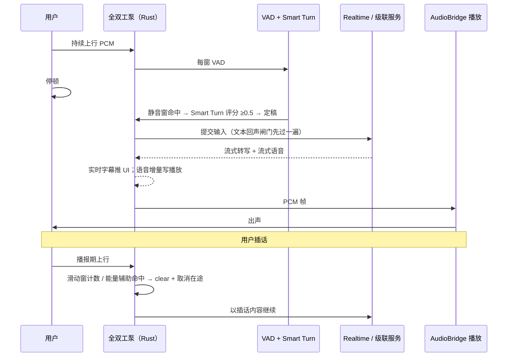

# 实时语音管线深度解析

这是 RoleAI 技术含量最高的一篇文档，讲清楚四个"实时语音桌面应用都绕不开"的问题各自怎么解：**怎么判断用户说完了**、**怎么不被自己的声音污染**、**怎么被打断**、**断了怎么恢复**。每个问题按「问题 → 方案 → 取舍 → 相关代码」展开。所有数字都来自代码常量或本机真机实测记录，出处随文给出。

前置阅读：[架构说明](architecture.md)。

## 1. 怎么判断用户说完了：两级断句

**问题。** 流式语音对话的第一件事是知道"这一句说完了"，才能提交识别、触发回答。判早了会在停顿时抢答，判晚了用户等得难受。只靠音量或概率阈值都不够：自然的语句里有词间停顿，而"嗯……让我想想"又是真的没说完。

**方案。** RoleAI 用两级检测：

1. **Silero VAD 判「在说话」**：16 kHz 采样，512 采样一窗（32 ms），模型输出窗口内含人声的概率。推理失败按无语音处理，不让错误冒泡进实时采集路径。话语分段器在 48 kHz 帧上工作：20 ms 一帧，连续 3 帧（60 ms）人声即开口，35 帧（700 ms）静音即收尾，同时要求最少 200 ms 语音、单句上限 25 s，开头保留 200 ms 预滚，最多排队 2 句。
2. **Smart Turn 判「说完了」**：pipecat-ai 的 smart-turn-v3 模型（ONNX int8，约 8.7 MB，随包分发），输入最近 8 秒音频的 Whisper 对数梅尔特征，输出"回合已完成"的概率，阈值 0.5。特征提取精确对齐 HuggingFace `WhisperFeatureExtractor`：hann 周期窗、hop 160、slaney 梅尔滤波器组、log10 下限 1e-10、`(x+4)/4` 归一化——对齐是拿 `inference.py` 逐行核对出来的。

**取舍。**

- VAD 便宜但只能判"有声/无声"；Smart Turn 能理解语义完整度但要跑一次 ONNX。两级串联让 Smart Turn 只在静音窗口触发时出场，而不是每窗都算。
- 早期版本把「固定 700 ms 静音窗 + Smart Turn 保持态（最长 +2.5 s）」全部挡在提交之前，句尾延迟可感知。Realtime 模式下，支持服务端 VAD 的供应商把提交判据交给服务端，本地两级检测只在级联模式与不支持服务端 VAD 的线路上承担提交触发。
- 阈值取保守值（Smart Turn 0.5 即官方示例值；分段器最少 200 ms 语音防误触发），宁可偶尔晚半拍，不抢答。

**相关代码。** [audio/vad.rs](../src-tauri/src/audio/vad.rs)、[audio/segmenter.rs](../src-tauri/src/audio/segmenter.rs)（帧常量在文件头部）、[audio/smart_turn.rs](../src-tauri/src/audio/smart_turn.rs)（模型来源与特征对齐过程写在模块文档注释里）。

## 2. 回声：AI 播报时怎么不把自己的声音当成输入

**问题。** AI 从扬声器播报时，声音会被麦克风收回去；如果这段音频被转写成"用户发言"，模型就会对着自己的话作答，形成**自问自答循环**——这是全双工语音助手最经典的死法。

**方案。** 四道防线，从音频到文本逐层收窄：

1. **同一 AudioContext 触发浏览器 AEC**：工作台对练时，麦克风采集和播报共用一个 WebAudio `AudioContext`，让 Chromium 的回声消除看到播放信号，从源头压低回声。
2. **回声抑制窗 + 底噪追踪**：播报期间对上行音频做门控；打断监听器同时在播报期追踪"回声底噪"——窗口 RMS 取最小值缓慢上浮（每窗 2%，约 1.6 s 时间常数），有约 500 ms 的建底期（只追踪不计数，避免播放起始的回声 onset 误判）。
3. **当轮回声判定**：全双工泵同时观察播报 PCM 和麦克风 PCM，用皮尔逊相关判定"这轮上行是不是刚才播报的延迟回波"，命中即不入轮。
4. **文本回声闸门（最后一道）**：定稿的用户转写与最近播报文本做归一化比对。归一化要抹平 TTS 与 ASR 的系统性差异——TTS 念「现在是2026年9月28日，星期一」，ASR 转写常是「现在是二零二六年九月二十八日星期一」——所以统一转小写、全角折半角、丢弃标点空白、中文数字换算成阿拉伯数字。命中即整轮丢弃：包含关系（双方 ≥8 字符）或字符 bigram Dice 系数 ≥0.85。

**取舍。**

- Dice 阈值取 0.85（取高不取低）：漏掉一条回声的代价是自问自答循环（音频闸门兜住绝大多数），误吞真人确认句的代价是用户被无视。真机实测同句回声 Dice ≥0.9；「没错就是2026年9月28日星期一」对「现在是2026年9月28日星期一」约 0.84，必须放行。
- 归一化后不足 6 字符的转写不参与判定——哼声、单字应答不允许被误吞。
- 没有把宝押在任何单层上：浏览器 AEC 在 WebView 里不完全可控，系统 AEC 在虚拟声卡链路上不存在，所以文本层兜底永远保留。

**相关代码。** [features/session/web-audio-player.ts](../src/features/session/web-audio-player.ts)（共用 AudioContext）、[audio/barge_in.rs](../src-tauri/src/audio/barge_in.rs)（底噪追踪常量）、[services/realtime_pump.rs](../src-tauri/src/services/realtime_pump.rs)（皮尔逊当轮判定）、[services/echo_guard.rs](../src-tauri/src/services/echo_guard.rs)（文本闸门，模块头注释记录了阈值依据）。

## 3. 打断（barge-in）：随时插话

**问题。** 真人对话里打断是常态。但播报期间 WebView AEC 会把近端人声一起压低：真机实测，60% 满量程的人声在播报期的 Silero 概率只有 0.34~0.41，且在 0.31~0.77 之间高频抖动——纯概率阈值在双讲场景永远打不断。

**方案。**

- **滑动窗计数**：最近 8 窗（约 256 ms）内 ≥6 个人声窗即触发，用环形缓冲实现。滑动计数容忍 1~2 个低概率空隙——「连续 N 窗」的写法会被单个 0.3 以下的窗清零，实测自然语音的词间空隙就有这么长。触发延迟约 200–260 ms。
- **能量辅助判定**：窗口概率 ≥0.3 且能量明显高于播报期回声底噪（≥3× RMS）时也计为人声。回声窗的 RMS 贴着底噪走（底噪就是从它追踪出来的），人声叠加时能量跳变 3~20 倍，两者分得开。
- **触发后的动作**：清空播放缓冲（立即静音），取消在途响应；Realtime 模式按协议发取消/截断事件，让服务端也停；打断后从用户开口处继续收集音频，进入新一轮。播报走 AudioBridge 的 `--play-stream` 帧协议，`clear` 帧即清缓冲。

**取舍。**

- 触发阈值在「误打断」和「打不断」之间选了后者偏保守的一档：能量辅助判定兜住了 AEC 压低概率的双讲场景，代价是要维护底噪追踪状态。
- 打断后的在途响应按打断语义落库（不会丢字），文本照常进记录，方便回看"当时 AI 打算说什么"。

**相关代码。** [audio/barge_in.rs](../src-tauri/src/audio/barge_in.rs)（全部阈值常量与真机实测注释）、[native/AudioBridge/README.md](../native/AudioBridge/README.md)（帧协议：audio/clear/drain）。

## 4. Realtime 长连接：断线重连与上下文回放

**问题。** 端到端 Realtime 走 WebSocket 长连接。移动网络、代理、服务端发布都会断线；断线后如果简单重连，服务端已经不记得对话上下文，而盲目全量回放又会把 AI 自己说过的话再"说"一遍。

**方案。**

- **常驻执行器（actor）**：每条 Realtime 线路一个专用线程持有连接，对外只暴露命令/事件两个通道；协议差异（OpenAI、阿里云 DashScope、智谱）收敛在方言层——URL 路径、音频格式、默认音色、输入采样率各一份常量，新供应商加一份方言即可。
- **指数退避重连**：500 ms 起步、每次翻倍、30 s 封顶；空闲超过 120 s 主动重建，规避各家服务端不一致的空闲超时。
- **上下文逐条确认回放**：重连成功后把对话历史逐条 `conversation.item.create` 回放，每条确认后再放下一条，回放时**跳过 assistant 轮**——只回放用户输入，AI 的历史回答由模型在 system/上下文里看到，而不是当作需要重新生成的输入。
- **回答开始超时看门狗**：发完触发事件若迟迟收不到回答开始，按超时恢复到可重试状态，避免用户对着"永远不回答"的会话干等。

**取舍。**

- 回放逐条确认而不是一把梭：qwen 线路曾出现"断连 → 全量回放 → 服务端把 assistant 轮当新输入 → 生成 → 再断连"的死循环（提交 `22bd2a2` 修复），逐条确认 + 跳过 assistant 轮同时解决了正确性和雪崩。
- 重连期间麦克风输入在有界队列里继续积累，恢复后一次补上——用户不需要重说话。
- 无限重试到会话停止为止，重试间隔有上限，UI 显示重连中；失败到不可恢复时给出稳定错误码，输入保留在输入框。

**相关代码。** [providers/realtime_session.rs](../src-tauri/src/providers/realtime_session.rs)（退避与空闲常量、actor 线程）、[providers/realtime_protocol.rs](../src-tauri/src/providers/realtime_protocol.rs)（三种方言）、[services/realtime_pump.rs](../src-tauri/src/services/realtime_pump.rs)（重连状态与回放协调）。

## 5. 级联模式的重试策略，以及为什么不引入重试库

**问题。** 级联模式的 ASR / LLM / TTS 是三个独立 HTTP 请求，瞬时失败（连接错误、限流）很常见；但每轮对话是交互式的，重试策略稍有不慎就把"等一下"变成"卡死"。

**方案。** 三处调用收敛到共享的 `send()` 单点，做**有界重试**：连接失败与 HTTP 429/502/503/504 最多重试 2 次（间隔 300 ms / 900 ms），最终失败仍返回原稳定错误码。超时（单次已 30 秒）、401/403、其余 4xx、响应超限与解析失败一律不重试。

**取舍——为什么不用 [backon](https://github.com/Xuanwo/backon) 这类重试库**（完整调研见仓库 `docs/dependency-decisions.md` 2026-09-29 条目）：

- backon 本身质量与维护俱佳（Apache-2.0，活跃维护，官方 blocking 支持），**不是不可用，是不划算**：本项目只需要 2 次固定间隔重试，库能替代的只有"循环 + sleep + 计数"这 10~15 行骨架。
- 真正的领域逻辑——哪些错误可重试（连接错误 + 特定状态码）、流式路径一旦吐字不可重试——任何库都得自己写。
- 单调用点让自写版本改动集中、易于离线测试与审计，不新增依赖树。

**相关代码。** [providers/cascade.rs](../src-tauri/src/providers/cascade.rs)（`send()` 内 `RETRY_DELAYS` 与注释）。

## 6. onnxruntime 为什么静态链接

**问题。** VAD 和 Smart Turn 都依赖 onnxruntime。默认做法是运行时加载 `onnxruntime.dll`——Windows 会按 DLL 搜索顺序找库，用户机器 System32 里若有一个旧版 onnxruntime.dll（别的软件装的），应用就可能加载到它，轻则行为不一致，重则直接崩。这个坑在真机上真的踩到过。

**方案。** `ort` crate 关闭 `ort-load-dynamic` 特性，构建期静态链接 onnxruntime 1.22；版本钉死在 2.0.0-rc.10（rc.11+ 移除了 CPUExecutionProvider，升级会编译失败，Cargo.lock 一并钉住）。VAD 和 Smart Turn 复用同一个钉版 ort，不引入第二个 ort 版本。

**取舍。** 静态链接让二进制大几 MB、重编译变慢，换来"装完就能跑、行为不随用户机器变化"——对桌面应用是正确的交换。模型本身（Silero opset 16、Smart Turn int8）随包分发，全程离线推理，不联网。

**相关代码。** [Cargo.toml](../src-tauri/src/Cargo.toml)（`ort`、`silero-vad-rust`、`rustfft` 三段注释完整记录了钉版与静态链接的原因）。

## 一图流

## 延伸

- 各失败场景对应的用户文案与错误码：[故障排查](troubleshooting.md)。
- 这条管线的演进过程（瓶颈定位 → 方案 → 实施阶段）最初记录在内部设计文档中，核心结论已并入本文与 [architecture.md](architecture.md)。
